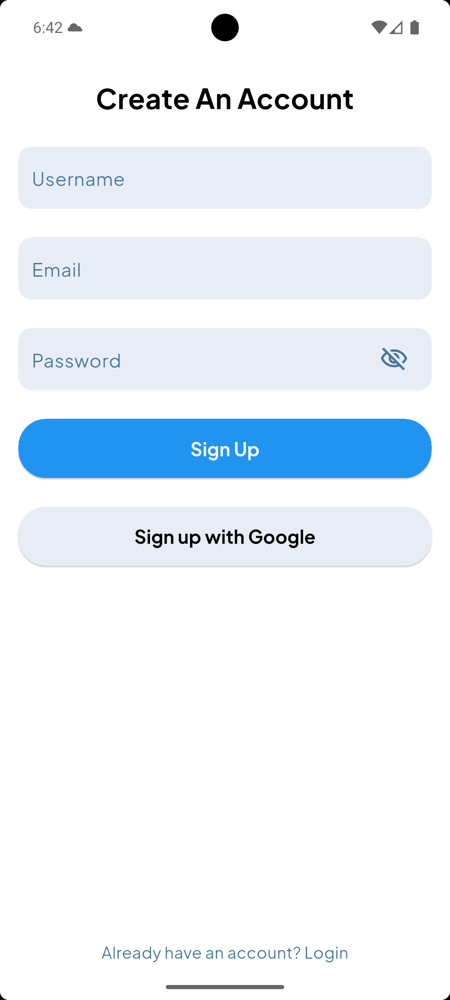
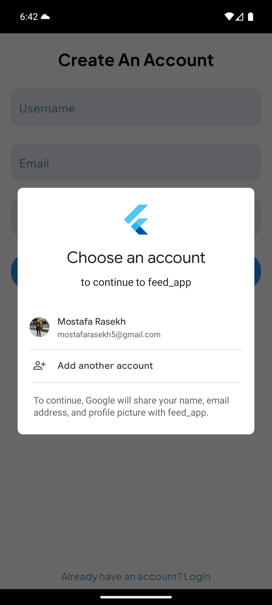
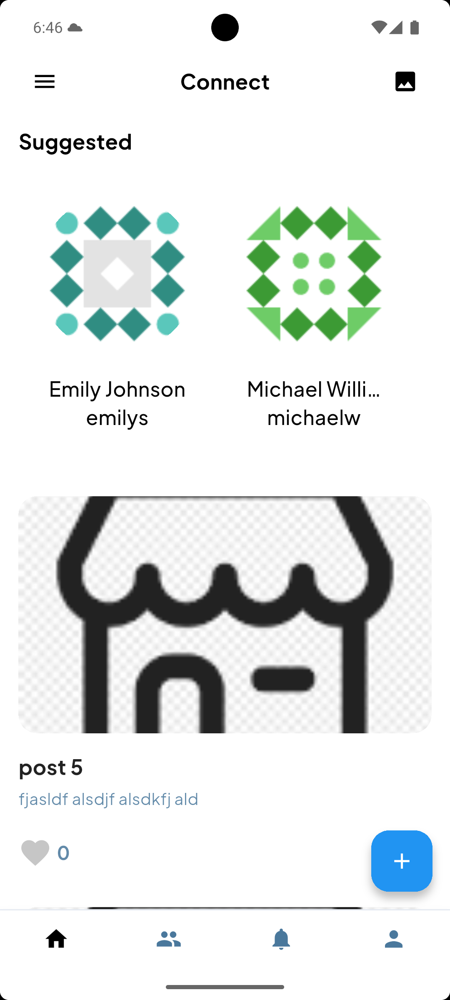
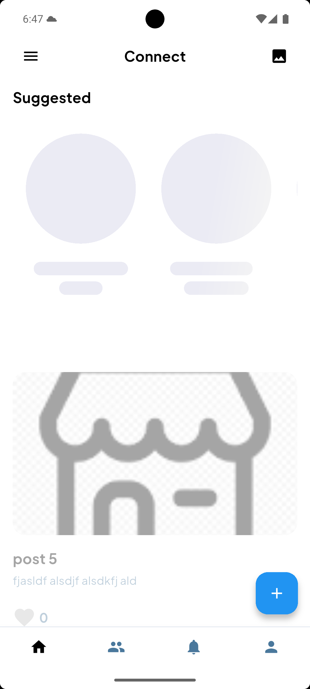
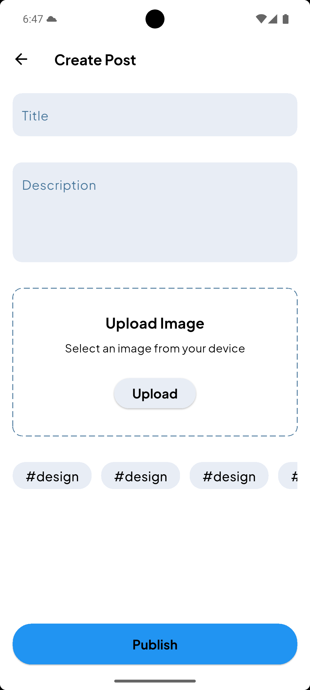
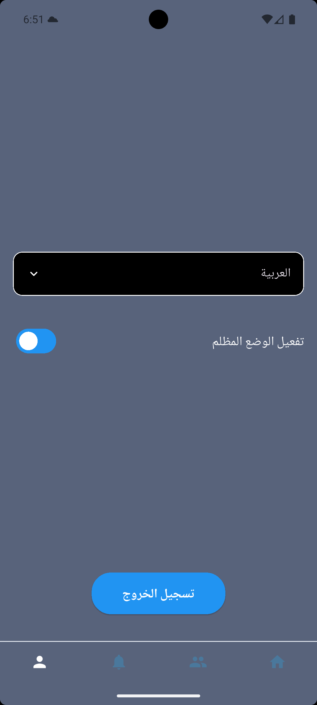

# 📱 Mini Social Feed App

A Flutter-based mini social feed application built with **Firebase**, **Cloudinary**, **REST APIs**, and **Google Mobile Ads SDK**.  
This project was developed as part of a technical assessment and demonstrates skills in authentication, state management, API integration, cloud storage, and ad monetization.

---

## ✨ Features

- 🔑 **Authentication**: Sign up / Sign in with Email & Password and Google Sign-In using Firebase Authentication.  
- 📰 **Feed Screen**: View posts with title, description, image, and like/unlike functionality (real-time updates via Firestore).  
- 👥 **Suggested Users**: Displayed horizontally, fetched from **DummyJSON API**.  
- ✍️ **Create Post**: Add posts with title, description, and image (images stored in **Cloudinary**).  
  - ⚠️ Faced an issue with Firebase Storage (billing upgrade required), solved it by integrating Cloudinary.  
- 📢 **Native Banner Ads**: Integrated with **Google Mobile Ads SDK**.  
- 🌙 **Creative Feature**: Added Dark Mode for a better user experience.  

---

## 📸 Screenshots

### 🔑 Authentication
  

### 📰 Feed Screen

### ✍️ Create Post

### 🌙 Dark Mode and creative features

---

## 🚀 Mostafa Mohamed
# mostafarasekh5@gmail.com
